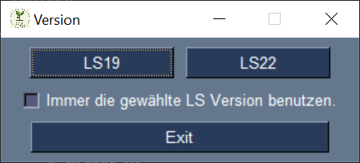
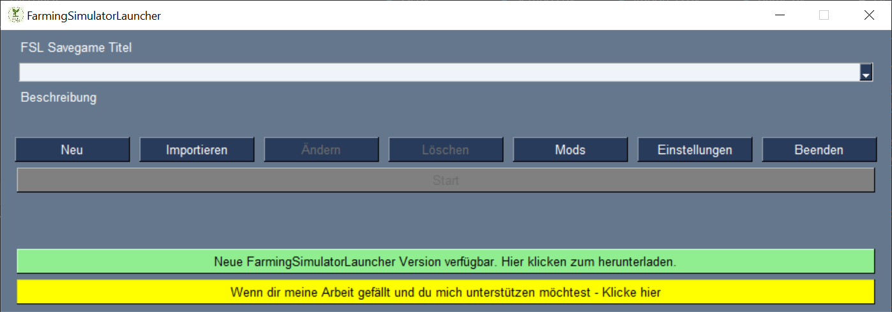

# FarmingSimulatorLauncher
Deutsch (English, French version below)

Der FarmingSimulatorLauncher (FSL) soll das Verwalten der verschiedenen Spielstände und Mods vereinfachen und funktioniert sowohl mit LS19 als auch mit LS22. Es kann die Giants oder Steam Version genutzt werden. FSL läuft auf PC und MacOS.  
  
Zur Verwaltung der Mods legt FSL einen eigenen Ordner an, in dem alle Mods, inkl. Mod-Maps, gespeichert werden.  
Es ist Möglich, von einem Mod oder einer Map mehrere Versionen in FSL zu importieren und in unterschiedlichen Savegames unterschiedliche Versionen zu nutzen.  
!!! Es ist aber weiterhin nicht möglich in einem Savegame unterschiedliche Versionen des selben Mods zu verwenden. !!!  
Weiterhin erzeugt FSL für jedes Savegame einen eigenen Ordner und einen dazugehörigen Backup Ordner. Somit gibt es, im Unterschied zum Landwirtschaftssimulator mehrere Backupordner.  
Beim Start eines Savegames, aus FSL heraus, wird das savegame1 angelegt und alle benötigten Mods in den LS-Modsordner verlinkt. Somit sind für LS nur die benötigten Mods sichtbar.  
Nach dem Spielstrt läuft FSL im Hintergrund weiter und syncronisiert die Savegame- und Backup-Ordner kontinuierlich.  
  
Ich habe versucht FSL, bzw. das Savegame- / Modhandling so stabil und sicher wie möglich zu machen.  
Der sicherste Weg ist es immer FSL zu nutzen, um zu spielen, Savegames zu verwalten und Mods hinzuzufügen. Sollte es vorkommen, dass LS ohne FSL benutzt / gespielt wird, sollte FSL dies beim nächsten Start erkennen und versuchen die Änderungen zu importieren oder zu sichern.

**Ich übernehme ausdrücklich keine Gewähr für verloren gegangene / kaputte Savegame und / oder Mods.**
Bitte sichert eure Savegames / Mods vor dem ersten Start von FSL.

## Allgemein
Beim Start erscheint zuerst die Auswahl, welches LS Version benutzt werden soll.  
  
Sollte nur eine Version installiert oder von FSL verwaltet werden, kann der Haken bei "Remember FS version for future starts?" gesetzt werden, bevor die Version angeklickt wird.  
Dies kann in den Einstellungen geändert werden.  
Wenn die erste Start erfolgreich abgeschlossen ist öffnet sich das Hauptfenster.  
  
Im Dropdownmenü können die in FSL gespeicherten Savegames ausgewählt werden. Die Einträge setzen sich dabei aus dem Savegamenamen und der verwendeten Map zusammen. Wird eine Vanila Map benutzt wird als Mapname "LS Standard Map" verwendet.
Unter Beschreibung wird die während des Anlegens des Savegames eingetragene Beschreibung angezeigt.
### Tasten
#### ***Neu***
Anlegen einen neuen Savegames. Siehe *Savegame anlegen*
#### ***Importieren***
Importieren eines vorhanden Savegames. Siehe *Savegame importieren*
#### ***Ändern***
Ändern des ausgewählten Savegames. Taste wird eingeschaltet wenn ein Savegame ausgewählt wurde. Siehe *Savegame ändern*
#### ***Löschen***
Löschen des ausgewählten Savegames. Taste wird eingeschaltet wenn ein Savegame ausgewählt wurde. Siehe *Savegame löschen*
#### ***Mods***
Öffnet die Modverwaltung. Siehe *Mods*
#### ***Einstellungen***
Öffnet das Einstellungsmenü für FSL. Siehe *FSL Einstellungen*
#### ***Beenden***
Beendet FSL
#### ***Start***
Startet das ausgewähle Savegame. Taste wird eingeschaltet wenn ein Savegame ausgewählt wurde. Siehe *Savegame starten*
#### ***Update***
Öffnet den die Webseite mit dem letzten FSL Release. Taste nur verfügbar wenn es eine neuere Version als die benutzte gibt.
#### ***Spende***
Wenn man mich und meine Arbeit unterstützen möchte ... ;)

## Erster Start
Beim ersten Start müssen als erstes die Pfade gesetzt werden. Siehe hierzu *FSL Einstellungen*.  
Danach sucht FSL in dem entsprechenden Ordner nach Mod- und Savegameordnern. Diese können dann importiert werden. Falls nicht, erzeugt FSL Backups der Ordner.  
Sollten Ordner nicht gefunden werden, können diese später auch manuell importiert werden. Siehe hierfür *Savegame importieren* bzw. *Mods importieren*
## Savegame
### Savegame anlegen
### Savegame importieren
### Savegame ändern
### Savegame löschen
### Savegame starten
## Mods
### Mods importieren
### Mods löschen
## FSL Einstellungen
## FSL updaten

English
## First start
## Savegame
### New savegame
### Import savegame
### Change savegame
### Remove savegame
## Mods
### Add
### Remove
## Settings
## Update FSL
