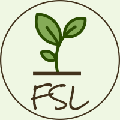

# FarmingSimulatorLauncher

Der FarmingSimulatorLauncher (FSL) soll das Verwalten der verschiedenen Spielstände und Mods vereinfachen und flexibler gestalten.  
  
Zur Verwaltung der Mods legt FSL einen eigenen Ordner an, in dem alle Mods, inkl. Mod-Maps, gespeichert werden.  
Es ist Möglich, von einem Mod oder einer Map mehrere Versionen in FSL zu importieren und in unterschiedlichen Savegames unterschiedliche Versionen zu nutzen.  
**!!!** Es ist aber weiterhin nicht möglich in einem Savegame unterschiedliche Versionen des selben Mods zu verwenden. **!!!**  
FSL erzeugt für jedes Savegame eine Konfiguration. Die Konfiguration beinhaltet die verwendete Map, die verwendeten Mods, den Namen des Savegames ()erscheint später auch im LS), den Ordner in dem das Savegame gespeichert wird und die Beschreibung. Weiterhin legt FSL zu einem Savegame einen eigenen Savegameordner und einen eigenen Backup Ordner an. Somit gibt es, im Unterschied zum Landwirtschaftssimulator mehrere Backupordner.  

Er funktioniert sowohl mit dem LS19 als auch mit dem LS22 und es kann die Giants oder Steam Version genutzt werden. FSL läuft auf Windows PC's und MacOS.  

Beim Start eines Savegames, aus FSL heraus, wird das savegame1 angelegt und alle benötigten Mods in den LS-Modsordner verlinkt. Somit sind für LS nur die benötigten Mods sichtbar, es gibt bspw. nur eine Mod Map und es werden auch nur die zum Savegame definierten Skript Mods geladen.  
Nach dem Spielstart läuft FSL im Hintergrund weiter und synchronisiert die Savegame- und Backup-Ordner kontinuierlich.  
  
Ich habe versucht FSL, bzw. das Savegame- / Modhandling so stabil und sicher wie möglich zu machen.  
Am sichersten ist es, um zu spielen, Savegames zu verwalten und Mods hinzuzufügen, immer FSL zu nutzen. Sollte es trotzdem mal vorkommen, dass LS ohne FSL benutzt / gespielt wird, sollte FSL dies beim nächsten Start erkennen und versuchen die Änderungen zu importieren oder zu sichern.

**Ich übernehme ausdrücklich keine Gewähr für verloren gegangene / kaputte Savegame und / oder Mods.**  
Bitte sichert eure LS Savegames / Mods vor dem ersten Start von FSL.

Der FSL ist kein Designglanzstück. Ich habe mehr Wert auf die Funktionalität gelegt. Besonders unter MacOS fällt dies auf.

  

**Achtung: Unter Windows muss FSL als Adminstrator gestartet werden, da sonst die Datei- / Ordneroperationen nicht möglich sind.** Siehe **Tipps - Administratorrechte bekommen**

## FSL Tests
* Windows 10, lokale Installation, LS19 - pass
* Windows 10, Steam Installation, LS19 - pass
* Windows 10, lokale Installation, LS22 - pass
* Windows 10, Steam Installation, LS22 - ungetestet
* MacOS Catalina, lokale Installation, LS19 - pass
* MacOS Catalina, Steam Installation, LS19 - pass
* MacOS Catalina, lokale Installation, LS22 - ungetestet
* MacOS Catalina, lokale Installation, LS22 - ungetestet

Fehler bitte über [GitHub](https://github.com/Dueesberch/FarmingSimulatorLauncher/issues/new) melden und Label *bug* auswählen.

## Geplante Erweiterungen (Backlog)
* Tooltips zu Feldern hinzufügen
* Laden alter Spielstände
* Prüfen ob ein Mod von einer Konfiguration benutzt wird beim Löschen
* Unbenutzte Mods finden
* Beim Import von Mods prüfen ob diese zur gewählten Version passen
* Beim Anlegen einer neuen Konfiguration den savegame Ordner mit default Dateien erstellen
* Verwalten von Ordnern wie modsettings etc.
* Mods (Qelldatei) nach import Moddatei löschen anstatt gesamten Ordner
* Mod Updates verwalten
* Einstellung LS Vorspann abschalten
* Einstellung savegame direkt starten in LS (Singleplayer)
* Mods in careerSavegame.xml entsprechend der Konfuguration setzen (Einschalten in LS entfällt)
* Karte updaten
* Konfiguration kopieren
* orginal LS Setup wieder herstellen
* Nur Mods auflisten die noch nicht importiert wurden

Gewünschte Erweiterungen bitte über [GitHub](https://github.com/Dueesberch/FarmingSimulatorLauncher/issues/new) melden und Label *feature request* auswählen.  
  
## Falls du mich und meine Arbeit unterstützen möchtest > [Spende](https://www.paypal.com/donate/?hosted_button_id=ZR4EGNDAVD4Q4)  
