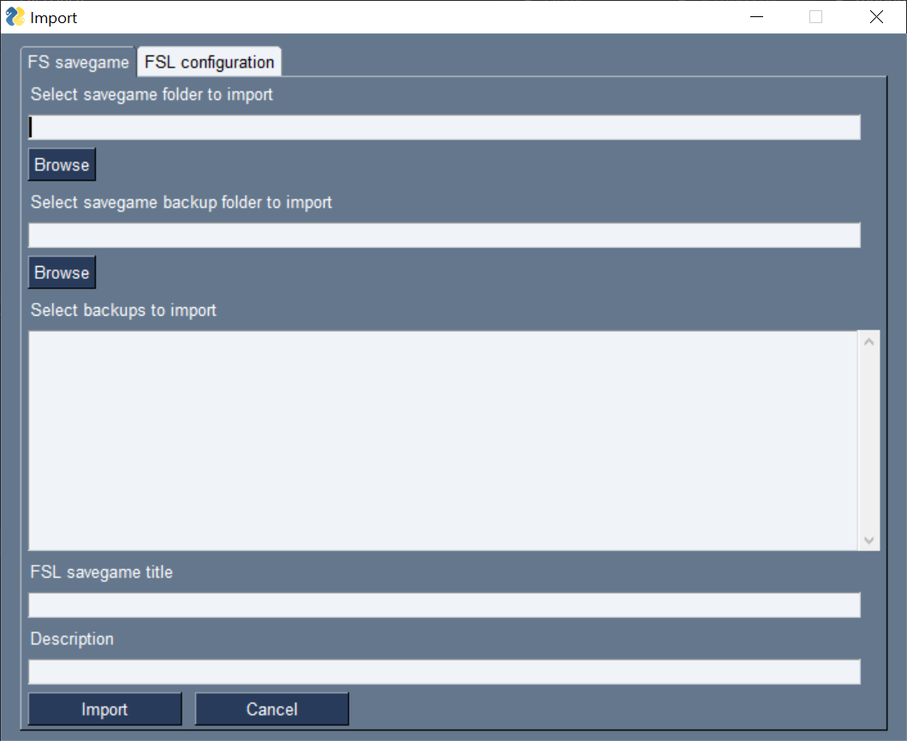

# FarmingSimulatorLauncher

The goal of the FarmingSimulatorLauncher (FSL) is to simplify the savegame and mod management and make it more flexible.  
  
Therefore FSL is creating a special folder to store all mods including mod maps.  
It is possible to import different version of the same mod or map and use that different versions in different savegames. That makes it possible to test mods before change completely.  
**!!!** But it is still not possible to use different versions of one mod at the same savegame. **!!!**  
FSL will create a configuration for every savegame. That configuration conatins the used map, the used mods, the name of the savegame (used later inside FS), the folder path where the savegame is stored and the description.
Additionally FSL is creating an own folder and also an own backup folder for every savegame. So there wil be plenty backup folders instead of one for all.  

FSL is working with FS19 and FS22 and can be used with Giants or Steam installation. It is running on Windows PC's and MacOS.  

When Farming Simulator is started by FSL, FSL is creating the savegame1 and links all required mods into the FS mods folder. So only the required mods are visible for FS. There is for example only one map file at the mods folder and not all existing script mods will be loaded by FS, only the required.  
FSL is running in background after game start and is syncing the savegame and backup folder continuously.  

I tried to make FSL as stable and save at possible.
The safest way is to use FSL to start the game, manage savegames and mods. Should it happen that FS is started without FSL, should FSL recognize that at the next start and try to import or backup the changes.

**I do not assume responsibility for lost savegames and / or mods.** Please backup your original savegames and mods before you use FSL the first time.

The FSL isn't a design highlight. The focus was mor on functionality. That is mostly visible at MacOS. Unfortunately, it isn't possible to show a splash screen at MacOS. So it takes a while until you see the FSL window appear. Be patient. 

**Attention: FSL must be started with administrator rights at windows, otherwise the required file and folder operations aren't possible.** See **Recommendation - Get administrator rights**  
**Attention: FSL must be extracted after Download. To start hold Ctrl and click. Select Open. At the Warning window click open.**

## General
At the FSL, first the FS version selection must be done.  
  
Is there only one version installed or shall only one version managed, it is possible, before version selection, to set ***Use always the selected FS version***. That in future will the dialog will not appear anymore.  
It is possible to set or remove that later at the settings.  

If the first start is successful done (see **First start**) the main window appear.  
  
At the drop down list a stored savegame configuration can be selected. Savegames must be imported, from FS savegames, or new created before. The list entries are combined by savegame name and map name.  
During the import or creation it is possible to give a small description which will be displayed under the drop down list.  

### Buttons
***New*** Create new savegame. See **Create savegame**  

***Import*** Import existing savegame or savegame configuration. See **Import savegame** or **Import savegame configuration**  

***Change*** Change selected savegame configuration. Button enabled after savegame selection. See **Change savegame configuration**  

***Remove*** Remove selected savegame configuration. Button enabled after savegame selection. See **Remove savegame configuration**  

***Mods*** Open mod management. See **Mods**  

***Settings*** Open FSL settings menu. See **FSL Settings**  

***Exit*** Close FSL  

***Start*** Start FS with the selected savegame configuration. Button enabled after savegame selection. See **Start savegame**

***Update*** Open webpage with latest FSL release. Button only visible if a new version is released.  

***Donate*** If you want to support my work ... ;)

## First start
At the first start the required path's must be set. See **FSL settings**  
Afterwards FSL is looking for the `mod` folder. The mods can be imported then.  
Is the import accepted all found `mods` will be imported into an fsl-all-mods folder.  
 !!! The original mods folder will be deleted after the import. That is necessary because FSL is creating an empty mods folder at game start which will held only required mods. !!!  
Finally it is possible to select additional mods folder and import mods from there. See **Import mods**

If the import is rejected FSL will move `mods` to `mods_fsl_bak`  

Then FSL will look for savegame folder. It is possible to import them, if found.  
The import window is opened for every savegame, if import is accepted. The title is a proposal and can be changed.  
The folder path is fix. See **Import savegame**  
FSL will move the `savegame` and `savegameBackup`folder to `savegameX_fsl_bak` respectively to `savegameBackup_fsl_bak`, if the import is rejected.  
If a savegame and / or mod folder isn't discovered by FSL, it is possible to import them later manually. See **Import savegame** respectively **Import mods**  
If the import is done the main window appear and the configurations of the imported savegames are listed at the drop down list. If there isn't an according map file for an imported savegame the map title is set to "ghost map". You can check which map is missing at the change window after select the savegame. The map can then imported at ***Mods***

FSL will create different configuration files on Windows at `~/AppData/Roaming/FarmingSimulatorLauncher/` and on  MacOS at `~/Library/Application Support/FarmingSimulatorLauncher/`.

## Savegame
### Create savegame configuration
Here new savegame configurations will be created.  
  
  

The ***FSL savegame title*** is required. With that title the configuration and the according folder will be created. Colon isn't allowed here.  

The field ***Description*** is optional.  

A map must be selected at ***Map***.  

The mods which should be used at the savegame can be selected at the list of available **Mods**.  
The selection is done by:  
***mouse click*** Only the clicked entry will be selected. Al already selected entries will be unselected.  
***Ctrl + mouse click*** The selected entry will be additionally selected to the already selected.  
***Shift + mouse click*** All entries between the last selected one and the new one will be selected.

At ***Save***, the title will be check if ok and not already used and if a map is selected. Additionally the mods will be checked that only one version is selected. If everything ok the configuration will be created and the window will be closed.

***Cancel*** will close the window without saving the new configuration.

### Import savegame
Here it is possible to import already existing savegames from FS into FSL.  

  
Attention:  FS will not create a savegame for multiplayer when it is client. So it isn't possible to import one. But FSL requires the information which mods shall be provided for FS. So it is necessary to create a savegame configuration also when the savegame is only at the client. See **Create savegame configuration**

First the FS savegame folder must be selected which shall be imported.
After that the folder with the backups can be set and the backups to import can be selected.  
The selection is done by:  
***mouse click*** Only the clicked entry will be selected. Al already selected entries will be unselected.  
***Ctrl + mouse click*** The selected entry will be additionally selected to the already selected.  
***Shift + mouse click*** All entries between the last selected one and the new one will be selected.

The ***FSL savegame title*** is required. With that title the configuration and the according folder will be created. Colon isn't allowed here.  

The field ***Description*** is optional.  

At ***Import*** FSL will check if the title is ok and not already used. If so FSL will create a new configuration.  
Additionally FSL is checking if all required mods are available. If a mod isn't found FSL will a popup will appear. The list of missing mods is shown at ***Change*** at the main window and removed if unwanted.
The window is closed after import.

***Cancel*** will close the window without import.

### Import savegame configuration
Here it is possible to import a before exported savegame configuration. See **Recommendation - Share savegame configuration** or **Recommendation - Backup savegame configuration**  

  

***Browse*** will open the file dialog to select the ``fsl_sgc`` file. FSL will check if the title is already used and will display that beside the title field.  

***Import*** - Isn't there a configuration with that title already (Exists: no) FSL will add the configuration as new.  
Is there already a configuration with that title (Exists: yes) the existing configuration will be replaced  

***Cancel*** close the window without import.  

### Change or export savegame configuration
Here it is possible to change already existing configurations or export them.  

  

The ***FSL savegame title*** can be changed but must be set. Colon isn't allowed.  

The field ***Description*** is optional. It is possible to add, remove or change the description.  

***Map*** can't be changed.  
If the map file is missing ("ghost map") an according notice is displayed at that field including map name and version. The map can be imported then. See **Import mods**  

It is possible to change the used mods at the ***Mods*** list. Already used mods are marked. To add new mods they must be marked or to remove mods they must be unmarked. The mod is only removed from configuration. To remove the mod completely from FSL use **Mods** at main window.  
The selection is done by:  
***mouse click*** Only the clicked entry will be selected. Al already selected entries will be unselected.  
***Ctrl + mouse click*** The selected entry will be additionally selected to the already selected.  
***Shift + mouse click*** All entries between the last selected one and the new one will be selected.  

***Export*** will create a ``SAVEGAMENAME.fsl_sgc`` file and store at the selected folder.  
That file can be imported then. See **Import savegame configuration**  
Additionally it is possible to create a folder with all for the savegame required mods to upload these to an eg dedi server.  

If the title, the description or the mod list changed, the export button will switch to save.
***Save*** will store the changed configuration and it is possible to export then.

With ***Mark used mods*** the current stored mod selection will be reset at the list. The new selection will be discard.

At ***Missed mods*** all not already imported mods at FSL will be listed. It is possible to remove them from configuration. Import the mod is possible at **Mods** at the main window. See **Import mods**  

***Cancel*** will close the window without change

### Remove savegame
At the main window the selected savegame can be removed.  
Attention: The configuration and the according folders will be removed.

### Start savegame configuration
At the main window the selected savegame can be started by ***Start***
The selected savegame will be available at savegame1 in FS.  

## Mods
### Import or remove mods
At the **Mods** window the mods will be managed. It is possible to import new mods or remove existing.

### Import
With ***Browse*** the folder where FSL shall look for mods can be selected here.  

***To import*** list all found mods and can be selected here.  
The selection is done by:  
***mouse click*** Only the clicked entry will be selected. Al already selected entries will be unselected.  
***Ctrl + mouse click*** The selected entry will be additionally selected to the already selected.  
***Shift + mouse click*** All entries between the last selected one and the new one will be selected.

***Import*** will copy all selected mods into fsl-all-mods folder.  
After that it is possible to delete the selected folder. Attention, the whole folder will be removed.
After the import the savegame configurations can be selected where to update or add the according mod.

### Remove
***Already imported mods*** list all available mods. Here it is possible to select all mods to remove.  

***Remove*** will delete the mod file at the fsl-all-mods. The mod isn't available for all savegames then.

***Exit*** will close the window.

## FSL settings
Here the settings for FSL will be managed.

  

The picture is representative for both FS versions.

The FSL language can be selected at ***Select language***. All existing will be listed at the drop down menu.  

If the ***Use always the selected FS version*** is set the current selected FS version will be used in future and the selection dialog at the start will not appear.  

At ***Select farming simulator executable*** the currently set path to Farmingsimulator19.exe or Farmingsimulator22.exe at Windows or FarmingSimulator2019Game or FarmingSimulator2022Game at MacOS is shown.
By ***Browse*** the path to file can be changed.
***Default FS19 path*** will set the path to 
`C:\Program Files (x86)\Farming Simulator 2019\Farmingsimulator2019.exe`  
at Windows and  
`/Applications/Farming Simulator 2019.app/Contents/MacOS/FarmingSimulator2019Game`  
at MacOS. At FS22 the button is ***Default FS22 path*** and the path is set accordingly.
***Default LS19 steam path*** will set  
`C:/Program Files (x86)/Steam/SteamApps/Common/Farming Simulator 19/FarmingSimulator2019.exe`  
at Windows and  
`~/Library/Application Support/Steam/SteamApps/common/Farming Simulator 19/Farming Simulator 2019.app/Contents/MacOS/FarmingSimulator2019Game`  
at MacOS. At FS22 the button is ***Default FS22 steam path*** and the path is set accordingly.  

At ***Select farming simulator gaming data folder*** the currently set path to the FS savegame folder is shown.
By ***Browse*** the path to the folder can be changed.
***Default FS19 savegame data folder*** will set the path to  
`C:/Users/USERNAME/Documents/My Games/FarmingSimulator2019`  
at Windows and  
`~/Library/Application Support/FarmingSimulator2019`  
at MacOS. At FS22 the button is ***Default FS22 savegame folder path*** and the path is set accordingly.  

The path set at ***Select folder at all mods*** is used to create the fsl-all-mods folder. At that folder all imported mods will be stored. Please be aware that there is enough disk space.  
Beside check that the folder isn't inside the `My Games/FarmingSimulator20XX/mods/` folder. That folder is reset always when FSL stars and the fsl_all_mods folder will be deleted.
See **Recommendation - Share mods**

***Save*** take the settings and close the window.  

***Exit*** close the windows without saving.  

## Update FSL
FSL will check at every start if there is a new version. If so, the according button will be visible at the main window. The button will open the page with the latest release at the web browser. There the newest version can be downloaded, but the current local version will not replaced.

## Recommendation
### Get administrator rights
#### Variant 1 (single shot):
1. right click at FarmingSimulatorLauncher.exe
2. Select "Run as administrator"
#### Variant 2 (permanent):
1. right click at FarmingSimulatorLauncher.exe
2. Select "Properties"
3. Select tab "Compatibility"
4. Set "Run this program as administrator
5. Apply
After that a double click is enough to start FSL
#### Variant 3 (deactivate UAC):
At your own risk
1. Open "Registry editor"
2. Go to `Computer\HKEY_LOCAL_MACHINE\SOFTWARE\Microsoft\Windows\CurrentVersion\Policies\System`
3. Double click EnableLUA
4. Change value data from 1 to 0

### Share mods
We (me and my friends) got a cloud server for our fsl-all-mods folder, which is mounted at the explorer. Our game administrator is managing all the mods. He add or remove mods and so all tam members got the mod base. So the download and adding at every single computer is history.

### Share savegame configuration
As explained it is possible to export and import savegame configurations. We use our cloud server to share that configurations managed by our game administrator. Our admin is adding the required mods and enables them at the configuration. After he exported the configuration all team members can import and we are all at the same base. If the folder where the savegame configuration is imported from always the same, FSL is able to check for new configurations when it starts and it is possible to import them. So you will always get a notice when the administrator uploaded a new version to the cloud server.

### Backup savegame configuration
At the same way you can share configurations you can backup them. Export a config and later import will reset your changes.
