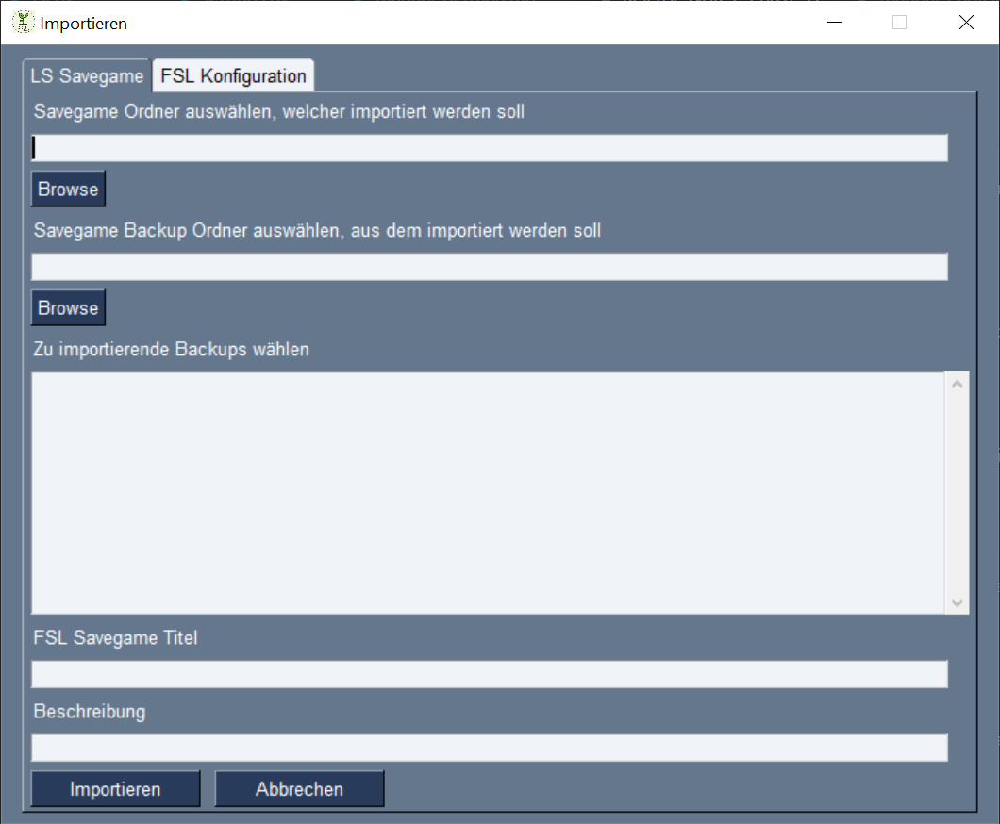
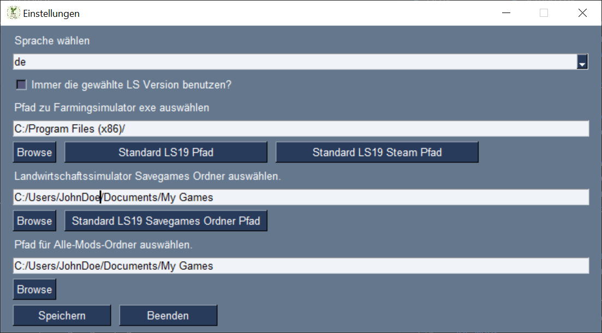

# FarmingSimulatorLauncher

The goal of the FarmingSimulatorLauncher (FSL) is to simplify the savegame and mod management and make it more flexible.  
  
Therfore FSL is creating a special folder to store all mods including mod maps.  
It is possible to import different version of the same mod or map and use that different versions in diffenent savegames.  
!!! But it is still not possible to use different versions of one mod at the same savegame. !!!  
For every savegame FSL is creating an own folder and also an own backup folder. So there wil be planty backup folders.  

FSL is working with FS19 and FS22 and can be used with Giants or Steam installation. It is running on Windows PC's and MacOS.  

When Farming Simulator is started by FSL, FSL is creating the savegame1 and links all required mods into the FS mods folder. So only the required mods are visible for FS and not all existing script mods will be loaded by FS.  
FSL is running in background after game start and is syncing the savegame and backup folder continuously.  

I tried to make FSL as stable and save at possible.
The safest way is to use FSL to start the game, manage savegames and mods. Should it happen that FS is started without FSL, should FSL recognize that at the next start and try to import or backup the changes.

**I do not assume responsibility for lost savegames and / or mods.** Please backup your original savegames and mods before you use FSL the first time.

The FSL isn't a design highlight. The focus was mor on functionality. That is mostly visible at MacOS.  

  

## General
At the FSL, first the FS version selection must be done.  
  
Is there only one version installed or shall only one version managed, it is possible, before version selection, to set "Remember FS version for future starts?". That in future will always work with that version and the dialog will not appear.  
It is possible to set or remove that later at the settings.  
If the first start successful done (see *First start") the main window appear.  
  
At the drop down list can a stored savegame be selected. Savegmaes must be imported, from FS savegames, or new created before. The list entrys are combined by savegame name and map name.  
During th import or creaton it is possibel to give a small description which will be displayed under the drop done list.

### Buttons
#### ***New***
Create new savegame. See *Create savegame*
#### ***Import***
Import existing savegame. See *Import savegame*

  

#### ***Change***
Change selected savegame. Button enabled after savegame selection. See *Change savegame*
#### ***Remove***
Remove selected savegame. Button enabled after savegame selection. See *Change savegame*
#### ***Mods***
Open mod management. See *Mods*
#### ***Settings***
Open FSL settings menu. See *FSL Settings*
#### ***Exit***
Exit FSL
#### ***Start***
Start selected savegame. Button enabled after savegame selection. See *Start savegame*
#### ***Update***
Open webpage with latest FSL release. Button only visible if a new version is released.
#### ***Donate***
If you want to support my work ... ;)

## First start
At the first start the required pathes must be set. See *FSL settings*  
Afterwards FSL is looking for the `mod` folder. The mods can be imported then.  
Is the import accepted all found mods will be imported into an FSL all mods folder.  
 !!! The original mods folder will be deleted after the import. That is neccessary because FSL is creating an empty mods folder at game start which will held only required mods. !!!  
Finaly it is possible to select addional mods folder and import mods from there. See *Import mods*
If the import is rejected FSL will move `mods` to `mods_fsl_bak`  

Then FSL will look for savegmae folder. It is possible to import them, if found.  
The import window is opened for every savegame, if import is accepted. The title is a proposal and can be changed.  
The folder path is fix. See *Import savegame*  
FSL will move the `savegame` and `savegameBackup`folder to `savegameX_fsl_bak` respectively to `savegameBackup_fsl_bak`, if the import is rejected.  
If a savegame and / or mod folder isn't discovered by FSL, it is possible to import them later manually. See *Import savegame* respectively *Import mods*  
If the import is done the main window appear and the imported savegames are listed at the drop down list. If there isn't an according map file for an imported savegame the map title is set to "ghost map". You can check which map is missing at the change window after select the savegame. The map can then imported at *Mods*

FSL will create different configuration files on Windows at `~/AppData/Roaming/FarmingSimulatorLauncher/` and on  MacOS at `~/Library/Application Support/FarmingSimulatorLauncher/`.

## Savegame
### Create savegame
Here new savegame configurations will be created. FSL is just creating an internal savegmae which will befilled by FS at the first start.  
  
  

The *FSL savegame Titel* is required. Unter diesem Titel werden die Einträge in der FSL Konfiguration erzeugt und die entsprechenden Ordner angelegt.  
Nicht erlaubt ist hier der Doppelpunkt..  
Das Feld *Beschreibung* ist optional.  
Es muss unter *Karte* eine Map ausgewählt werden.  
Aus der Liste der verfügbaren *Mods* werden diejenigen ausgewählt, welche für das Savegame verwendet werden sollen.  
Die Auswhal erfolgt über die Tastenkombinationen:  
#### ***Mausklick***  
Es wird lediglich der angeklickte Eintrag ausgewählt. Andere bereits ausgewählte Einträge werden abgewählt.
#### ***Strg + Mausklick***  
Es wird der angeklickte Eintrag zusätzlich zu den bereits ausgwählten ebenfalls ausgewählt.  
Wird mit dieser Kombination auf einen bereits ausgewählten Eintrag geklickt, wird die Auswahl für diesen Eintrag aufgehoben.
#### ***Shift + Mausklick***  
Alle Einträge zwischen dem zuletzt ausgewähltem Eintrag und dem aktuell angeklickten Eintrag werden ausgewählt.
  
Beim *Speichern* wird geprüft, ob der Titel in Ordnung ist und noch nicht benutzt wird und ob eine Karte ausgewählt wurde. Weitherin wird geprüft, dass die ausgewählten Mods nicht kollidieren. Eine Auswahl des selben Mods in unterschiedlichen Versionen ist nicht möglich. Ist alles in Ordnung wird das Savegame gespeichert und das Fenster geschlossen.  
*Abbrechen* verlässt das Fenster ohne einen neues Savegame anzulegen.

### Savegame importieren
Hierüber können bereits vorhanden Savegames aus dem LS in den FSL importiert werden.  

  
Achtung: Bei einem Multiplayerspiel wird im LS für den Client kein Savegame erzeugt. Somit kann natürlich auch keines importiert werden. FSL benötigt aber die Angabe, welche Mods für das Spiel zur Verfügung gestellt werden sollen. Es muss also ein neues Savegame angelegt werden. Siehe *Savegame anlegen*

Zuerst muss der LS Savegame Ordner ausgewählt werden, der importiert werden soll.  
Danach kann der Ordner mit den Backups angegeben werden und dann ausgewählt werden welche Backups übernommen werrden sollen.  
Die Auswhal erfolgt über die Tastenkombinationen:  
#### ***Mausklick***  
Es wird lediglich der angeklickte Eintrag ausgewählt. Andere bereits ausgewählte Einträge werden abgewählt.
#### ***Strg + Mausklick***  
Es wird der angeklickte Eintrag zusätzlich zu den bereits ausgwählten ebenfalls ausgewählt.  
Wird mit dieser Kombination auf einen bereits ausgewählten Eintrag geklickt, wird die Auswahl für diesen Eintrag aufgehoben.
#### ***Shift + Mausklick***  
Alle Einträge zwischen dem zuletzt ausgewähltem Eintrag und dem aktuell angeklickten Eintrag werden ausgewählt.
Der *FSL Savegame Titel* muss gesetzt werden. Unter diesem Titel werden entsprechende Einträge in der FSL Konfiguration erzeugt und die passenden Ordner angelegt.  
Nicht erlaubt ist hier der Doppelpunkt..  
Das Feld *Beschreibung* ist optional.  

Beim *Importieren* wird geprüft, ob der Titel in Ordnung ist und noch nicht benutzt wird. Ist alles in Ordnung wird das Savegame importiert. Der Savegameordner wird hierbei mit dem vergebenen Titel umbenannt und ggf. vorhandene LS Backup in den FSL savegame Backupordner verschoben.  
Außerdem prüft FSL ob die im Savegame verwendeten Mods bereits in FSL importiert wurden. Werden Mods gefunden, die noch nicht importiert wurden, weißt FSL darauf hin. Die Liste der fehlenden Mods kann dann unter Savegame *Ändern* im Hauptfenster angezeigt werden und ggf. aus dem Savegame gelöscht werden.  
Anschließend wird das Fenster geschlossen.  

*Abbrechen* verlässt das Importfenster ohne Import.

### Savegame ändern
Hierüber können bereits vorhanden FSL Savegames angepasst werden.
  
  
  
Der *FSL Savegame Titel* kann verändert werden, muss aber gesetzt sein.
Nicht erlaubt ist hier der Doppelpunkt..  

Das Feld *Beschreibung* ist optional. Es kann eine neue Beschreibung eingetragen, die vorhandene geändert oder gelöscht werden.  

Die *Karte* ist nicht änderbar.  
Sollte die Datei zur Karte in FSL noch fehlen, "Geisterkarte", wird ind diesem Feld der Kartenname und die entsprechende Version angezeigt. Diese kann dann importiert werden. Siehe *Mods importieren*

Unter *Mods* können die verwendeten Mods angepasst werden. Bereits verwendete Mods werden markiert. Es können Mods hinzugefügt (markiert) und Mods entfernt (Markierung löschen) werden. Der Mod wird nur aus der Savegame Konfiguration entfernt. Bleibt aber im FSL verhanden. Soll der Mod komplett gelöscht werden muss dies über das *Mods* Fenster erfolgen.  
Die Auswhal der Mods erfolgt über die Tastenkombinationen:  
#### ***Mausklick***  
Es wird lediglich der angeklickte Eintrag ausgewählt. Andere bereits ausgewählte Einträge werden abgewählt.
#### ***Strg + Mausklick***  
Es wird der angeklickte Eintrag zusätzlich zu den bereits ausgwählten ebenfalls ausgewählt.  
Wird mit dieser Kombination auf einen bereits ausgewählten Eintrag geklickt, wird die Auswahl für diesen Eintrag aufgehoben.
#### ***Shift + Mausklick***  
Alle Einträge zwischen dem zuletzt angeklickten Eintrag und dem aktuell angeklickten Eintrag werden ausgewählt.  

Über *Benutzte Mods markieren* wird die aktuelle Zuordnung zum Savegame wieder angezeigt.  

Unter *Fehlend* werden die Mods aufgelistet, welche nicht im FSL verfügbar sind. Diese können aus dem Savegame gelöscht werden. Das Importieren ist über Hauptfenster > Mods möglich. Siehe *Mods importieren*  

*Speichern* übernimmt die Änderungen für das Savegame und schliesst das Fenster.  

*Abbrechen* schliesst das Fenster ohne die Änderungen zu übernehmen.
### Savegame löschen
Im Hauptfenster kann das ausgewählte Savegame gelöscht werden.  
Achtung: Dadurch wird die FSL Konfiguration für das Savegame entfernt und die zugehörigen Ordner gelöscht.  

### Savegame starten
Ist ein Savegame im Hautpfenster ausgwählt, kann dieses über die Taste *Starten* gestartet werden.
Das ausgewählte Savegame steht in LS dann unter savegame1 zur Verfügung.  

## Mods
### Mods importieren oder löschen
Hierüber werden die in FSL verfügbaren Mods vewrwaltet. Es können neue Mods importiert werden und bereits importierte wieder entfernt werden.

### Import
Über *Browse* wird der Ordner ausgwählt, in dem nach Mods gesucht werden soll.  
*Zum Import* listet alle gefundenen Mods auf. Achtung: Es findet keine Unterscheidung der LS Versionen statt.  
Hierüber werden alle zu importierenden Mods ausgewählt.  
Die Auswhal erfolgt über die Tastenkombinationen:  
#### ***Mausklick***  
Es wird lediglich der angeklickte Eintrag ausgewählt. Andere bereits ausgewählte Einträge werden abgewählt.
#### ***Strg + Mausklick***  
Es wird der angeklickte Eintrag zusätzlich zu den bereits ausgwählten ebenfalls ausgewählt.  
Wird mit dieser Kombination auf einen bereits ausgewählten Eintrag geklickt, wird die Auswahl für diesen Eintrag aufgehoben.
#### ***Shift + Mausklick***  
Alle Einträge zwischen dem zuletzt angeklickten Eintrag und dem aktuell angeklickten Eintrag werden ausgewählt.  
*Importieren* fügt die ausgewählten Mods in den FSL Alle-Mods-Ordner ein.  
FSL bietet an, den Quellordner nach dem Import zu löschen. Achtung, es wird der gesamte Ordner gelöscht.
Nach dem Import können die Savegames ausgewählt werden, bei denen die Modversion geändert werden soll oder der Mod hinzugefügt werden soll.
Du Zuordung der Mod Versionen zu den Savegames wird nicht automatisch angepasst.
### Löschen
*Bereits importierte Mods* listet alle in FSL verfügbaren Mods auf. Hierüber können die Mods ausgewählt werden, die gelöscht werden sollen.
*Löschen* entfernt die markierten Mods aus dem FSL Alle-Mods-Ordner.  
*Beenden* schliesst das Fenster.

## FSL Einstellungen
Hierüber werden die FSL Einstellungen verwaltet.

  

Bild steht stellvertretend für beide LS Versionen.

Über *Sprache wählen* kann die FSL Sprache ausgewählt werden. Im Dropdownmenü werden alle verfügbaren Sprachen aufgelistet.  
Wird der Haken bei *Immer die gewählte LS Version benutzen* gesetzt, wird die Abfrage zum Programmstart übersprungen.  
Unter *Pfad zu Farmingsimulator exe auswählen* wird der gewählte Pfad zur Farmingsimulator19.exe bzw. Farmingsimulator22.exe für Windows oder FarmingSimulator2019Game bzw. FarmingSimulator2022Game für MacOS angezeigt.
Über *Browse* kann die Datei gesucht werden.  
*Standard LS19 Pfad* setzt  
`C:\Program Files (x86)\Farming Simulator 2019\Farmingsimulator2019.exe`  
unter Windows bzw.  
`/Applications/Farming Simulator 2019.app/Contents/MacOS/FarmingSimulator2019Game`  
unter MacOS ein. Für den LS22 ist die Taste mit *Standard LS22 Pfad* beschriftet und der Pfad wird analog gesetzt.  
*Standard LS19 Steam Pfad* setzt  
`C:/Program Files (x86)/Steam/SteamApps/Common/Farming Simulator 19/FarmingSimulator2019.exe`  
unter Windows bzw.  
`~/Library/Application Support/Steam/SteamApps/common/Farming Simulator 19/Farming Simulator 2019.app/Contents/MacOS/FarmingSimulator2019Game`  
unter MacOS ein. Für den LS22 ist die Taste mit *Standard LS22 Steam Pfad* beschriftet und der Pfad wird analog gesetzt.  
Unter *Landwirtschaftssimulator Savgames Ordner auswählen* wird der Pfad zu den LS Savegames angezeigt.  
Über *Browse* kann der Pfad gesucht werden.  
*Standard LS19 Savegames Ordner Pfad* setzt den Pfad auf  
`C:/Users/USERNAME/Documents/My Games/FarmingSimulator2019`  
für Windows bzw.  
`~/Library/Application Support/FarmingSimulator2019`  
für MacOS gesetzt. Für den LS22 ist die Taste mit *Standard LS22 Savegames Ordner Pfad* beschriftet und der Pfad wird analog gesetzt.  
Der bei *Pfad für Alle-Mods-Ordner auswählen* gesetzte Pfad wird von FSL benutzt um einen all_mods Ordner anzulegen. In diesem werden alle Mods gespeichert die in FSL importiert wurden. Achte daher auf ausreichend Speicherplatz.  
Tipp: Wir haben für unsere Mods einen Cloudserver, welcher im Explorer eingebunden ist. Alle Spieler haben diesen Ordner als Alle-Mods-Ordner gesetzt, wodurch die Möglichkeit besteht, dass der Admin neue Mods einfügt oder auch entfernt und alle immer mit der selben Modbasis arbeiten. Das Herunterladen und Einfügen bei jedem einzelnen entfällt. Aktuell werden aber die FSL Savegames noch nicht geteilt. Somit muss ein neuer Mod zumindest noch für das Savegame ausgewählt werden. Das Teilen von FSL Savegame Konfigurationen ist geplant.
*Speichern* übernimmt die Einstellungen.
*Beenden* verlässt das Fenster ohne zu speichern.
## FSL updaten
FSL prüft bei jedem Start, ob eine neu FSL Version verfügbar ist. Ist dies der Fall wird im Hauptfenster die entsprechende Taste angezeigt. Hierüber wird die Webseite mit der neusten Version geöffnet und die entsprechenden Datei können heruntergeladen und ausgetauscht werden. Ein automatisches ersetzen erfolgt nicht.  

## Problembehebung
### Mods Ordner geändert
### Savegameordner geändert
### Mod importiert, aber im Spiel immer noch alte Modversion
