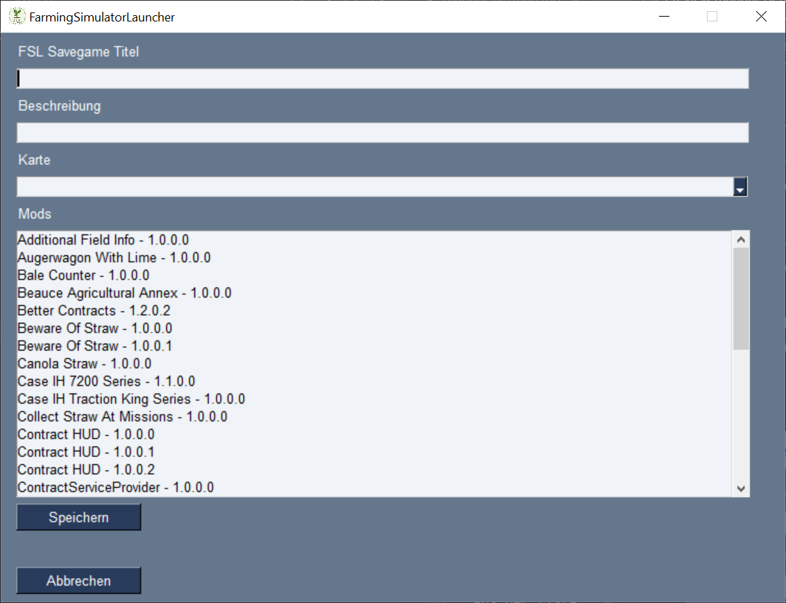
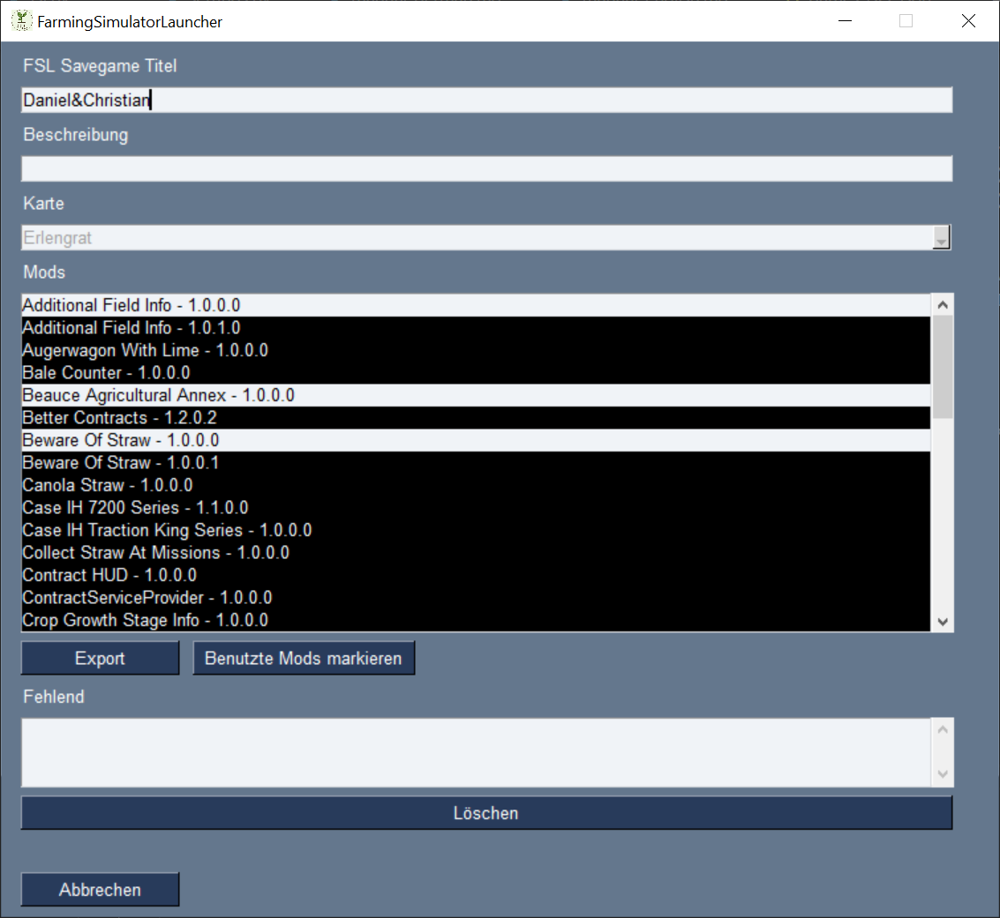

# FarmingSimulatorLauncher

Der FarmingSimulatorLauncher (FSL) soll das Verwalten der verschiedenen Spielstände und Mods vereinfachen und flexibler gestalten.  
  
Zur Verwaltung der Mods legt FSL einen eigenen Ordner an, in dem alle Mods, inkl. Mod-Maps, gespeichert werden.  
Es ist Möglich, von einem Mod oder einer Map mehrere Versionen in FSL zu importieren und in unterschiedlichen Savegames unterschiedliche Versionen zu nutzen.  
**!!!** Es ist aber weiterhin nicht möglich in einem Savegame unterschiedliche Versionen des selben Mods zu verwenden. **!!!**  
FSL erzeugt für jedes Savegame eine Konfiguration. Die Konfiguration beinhaltet die verwendete Map, die verwendeten Mods, den Namen des Savegames ()erscheint später auch im LS), den Ordner in dem das Savegame gespeichert wird und die Beschreibung. Weiterhin legt FSL zu einem Savegame einen eigenen Savegameordner und einen eigenen Backup Ordner an. Somit gibt es, im Unterschied zum Landwirtschaftssimulator mehrere Backupordner.  

Er funktioniert sowohl mit dem LS19 als auch mit dem LS22 und es kann die Giants oder Steam Version genutzt werden. FSL läuft auf Windows PC's und MacOS.  

Beim Start eines Savegames, aus FSL heraus, wird das savegame1 angelegt und alle benötigten Mods in den LS-Modsordner verlinkt. Somit sind für LS nur die benötigten Mods sichtbar, es gibt bspw. nur eine Mod Map und es werden auch nur die zum Savegame definierten Skript Mods geladen.  
Nach dem Spielstart läuft FSL im Hintergrund weiter und synchronisiert die Savegame- und Backup-Ordner kontinuierlich.  
  
Ich habe versucht FSL, bzw. das Savegame- / Modhandling so stabil und sicher wie möglich zu machen.  
Am sichersten ist es, um zu spielen, Savegames zu verwalten und Mods hinzuzufügen, immer FSL zu nutzen. Sollte es trotzdem mal vorkommen, dass LS ohne FSL benutzt / gespielt wird, sollte FSL dies beim nächsten Start erkennen und versuchen die Änderungen zu importieren oder zu sichern.

**Ich übernehme ausdrücklich keine Gewähr für verloren gegangene / kaputte Savegame und / oder Mods.**  
Bitte sichert eure LS Savegames / Mods vor dem ersten Start von FSL.

Der FSL ist kein Designglanzstück. Ich habe mehr Wert auf die Funktionalität gelegt. Besonders unter MacOS fällt dies auf.

  

**Achtung: Unter Windows muss FSL als Adminstrator gestartet werden, da sonst die Datei- / Ordneroperationen nicht gemacht werden können.**

## Allgemein
Beim Start erscheint zuerst die Auswahl, welche LS Version benutzt werden soll.  
  
Sollte nur eine Version installiert sein oder soll nur eine Version von FSL verwaltet werden, kann, bevor die Version ausgewählt wird, der Haken bei "Immer die gewählte LS Version benutzen." gesetzt werden. Dadurch erscheint der Auswahldialog zukünftig nicht mehr.  
Dies kann auch später in den Einstellungen eingestellt werden.  
Wenn der erste Start (Siehe *Erster Start*) erfolgreich durchlaufen wurde öffnet sich das Hauptfenster.  
  
Im Dropdownmenü können die in FSL gespeicherten Savegamekonfigurationen ausgewählt werden. Diese müssen vorher aus bestehenden Savegames importiert oder neu angelegt werden. Die Einträge im Dropdownmenü setzen sich dabei aus dem Savegamenamen und der verwendeten Map zusammen.  
Unter Beschreibung wird die während des Anlegens der Savegamekonfiguration eingetragene Beschreibung angezeigt.
### Tasten
#### ***Neu***
Anlegen einer neuen Savegamekonfiguration. Siehe *Savegamekonfiguration anlegen*
#### ***Importieren***
Importieren eines vorhanden Savegames oder einer Savegamekonfiguration. Siehe *Savegame importieren* bzw. *Savegamekonfiguration importieren*

  

#### ***Ändern***
Ändern der ausgewählten Savegamekonfiguration. Taste wird eingeschaltet wenn eine Konfiguration ausgewählt wurde. Siehe *Savegamekonfiguration ändern*
#### ***Löschen***
Löschen der ausgewählten Savegamekonfiguration. Taste wird eingeschaltet wenn eine Konfiguration ausgewählt wurde. Siehe *Savegamekonfigurtion löschen*
#### ***Mods***
Öffnet die Modverwaltung. Siehe *Mods*
#### ***Einstellungen***
Öffnet das Einstellungsmenü für FSL. Siehe *FSL Einstellungen*
#### ***Beenden***
Beendet FSL
#### ***Start***
Startet der ausgewählen Savegamekonfiguration. Taste wird eingeschaltet wenn eine Konfiguration ausgewählt wurde. Siehe *Savegamekonfigurtion starten*
#### ***Update***
Öffnet die Webseite mit dem letzten FSL Release. Taste nur verfügbar wenn es eine neuere Version als die Benutzte gibt.
#### ***Spende***
Wenn man mich und meine Arbeit unterstützen möchte ... ;)

## Erster Start
Beim ersten Start müssen zuerst die Pfade gesetzt werden. Siehe hierzu *FSL Einstellungen*.  
Danach sucht FSL im angegebenen Ordner nach dem `mods`-Ordner. Dieser kann dann importiert werden. 
Wird der Import durchgeführt werden zuerst die Mods aus dem `mods` Ordner in den FSL Alle-Mods-Ordner importiert.  
 !!! Der orginale `mods` Ordner wird nach dem Import gelöscht. Dies ist nötig, da FSL bei jedem Spielstart einen mods Ordner erzeugt, der nur die benötigten Mods enthält !!!  
Danach können weitere Mods aus anderen Ordnern importiert werden. Siehe *Mods importieren*  

Falls der Import abgelehnt wird, wird der `mods`-Ordner nach `mods_fsl_bak` verschoben.  
Danach sucht FSL im angegebenen Ordner nach savegame-Ordnern. Werden Entsprechende gefunden, können Diese ebenfalls importiert werden.  
Soll der Import durchgeführt werden öffnet sich für jedes Savegame das Importfenster. Der Titel ist ein Vorschlag und kann geändert werden. Der Ordnerpfad ist hier fest. Weiters siehe *Savegame importieren*.  
Falls der Import abgelehnt wird, werden die  entsprechenden `savegame`-Ordner und der `savegameBackup`-Ordner nach `savegameX_fsl_bak` bzw. `savegameBackup_fsl_bak` verschoben.  
Sollten Savegame- und / oder Modordner von FSL nicht automatisch erkannt werden, können Diese später auch manuell importiert werden. Siehe hierfür *Savegame importieren* bzw. *Mods importieren*  
Ist der Import abgeschlossen, öffnet sich das Hauptfenster und die importierten Savegames, sind im Dropdown verfügbar. Wurde zu einem Savegame keine Mapdatei gefunden, wird für den Kartennamen in der Dropdownliste "Geisterkarte" gesetzt. Welche Karte exakt fehlt kann über Ändern herausgefunden werden und unter Mods importiert werden.  

FSL legt seine Konfigurationsdateien auf Windows unter `~/AppData/Roaming/FarmingSimulatorLauncher/` bzw. auf MacOS unter `~/Library/Application Support/FarmingSimulatorLauncher/` ab.

## Savegame
### Savegamekonfiguration anlegen
Hierüber werden neue Savegamekonfigurationen angelegt. <!--Dabei wird aber nur ein FSL internes Savegame erzeugt, welches beim ersten Start im LS mit Daten gefüllt wird.-->  
  
  

Der *FSL Savegame Titel* muss gesetzt werden. Unter diesem Titel werden die Einträge in der FSL Konfiguration erzeugt und die entsprechenden Ordner angelegt.  
Nicht erlaubt ist hier der Doppelpunkt.  
Das Feld *Beschreibung* ist optional.  
Es muss unter *Karte* eine Map ausgewählt werden.  
Aus der Liste der verfügbaren *Mods* werden diejenigen ausgewählt, welche für das Savegame verwendet werden sollen.  
Die Auswhal erfolgt über die Tastenkombinationen:  
#### ***Mausklick***  
Es wird lediglich der angeklickte Eintrag ausgewählt. Andere bereits ausgewählte Einträge werden abgewählt.
#### ***Strg + Mausklick***  
Es wird der angeklickte Eintrag zusätzlich zu den bereits ausgwählten ebenfalls ausgewählt.  
Wird mit dieser Kombination auf einen bereits ausgewählten Eintrag geklickt, wird die Auswahl für diesen Eintrag aufgehoben.
#### ***Shift + Mausklick***  
Alle Einträge zwischen dem zuletzt ausgewähltem Eintrag und dem aktuell angeklickten Eintrag werden ausgewählt.
  
Beim *Speichern* wird geprüft, ob der Titel in Ordnung ist und noch nicht benutzt wird und ob eine Karte ausgewählt wurde. Weitherin wird geprüft, dass die ausgewählten Mods nicht kollidieren. Eine Auswahl des selben Mods in unterschiedlichen Versionen ist nicht möglich. Ist alles in Ordnung wird die Savegamekonfiguration gespeichert und das Fenster geschlossen.  

*Abbrechen* verlässt das Fenster ohne eine neue Savegamekonfiguration anzulegen.

### Savegame importieren
Hierüber können bereits vorhanden Savegames aus dem LS in den FSL importiert werden.  

  
Achtung: Bei einem Multiplayerspiel wird im LS für den Client kein Savegame erzeugt. Somit kann natürlich auch keines importiert werden. FSL benötigt aber die Angabe, welche Mods für das Spiel zur Verfügung gestellt werden sollen. Es muss also ein neue Savegamekonfiguration angelegt werden. Siehe *Savegamekonfiguration anlegen*

Zuerst muss der LS Savegame Ordner ausgewählt werden, der importiert werden soll.  
Danach kann der Ordner mit den Backups angegeben werden und dann ausgewählt werden welche Backups übernommen werrden sollen.  
Die Auswhal erfolgt über die Tastenkombinationen:  
#### ***Mausklick***  
Es wird lediglich der angeklickte Eintrag ausgewählt. Andere bereits ausgewählte Einträge werden abgewählt.
#### ***Strg + Mausklick***  
Es wird der angeklickte Eintrag zusätzlich zu den bereits ausgwählten ebenfalls ausgewählt.  
Wird mit dieser Kombination auf einen bereits ausgewählten Eintrag geklickt, wird die Auswahl für diesen Eintrag aufgehoben.
#### ***Shift + Mausklick***  
Alle Einträge zwischen dem zuletzt ausgewähltem Eintrag und dem aktuell angeklickten Eintrag werden ausgewählt.  

Der *FSL Savegame Titel* muss gesetzt werden. Unter diesem Titel werden entsprechende Einträge in der FSL Konfiguration erzeugt und die passenden Ordner angelegt.  
Nicht erlaubt ist hier der Doppelpunkt.  
Das Feld *Beschreibung* ist optional.  

Beim *Importieren* wird geprüft, ob der Titel in Ordnung ist und noch nicht benutzt wird. Ist alles in Ordnung wird das Savegame importiert. <!-- Der Savegameordner wird hierbei mit dem vergebenen Titel umbenannt und ggf. vorhandene LS Backups in den FSL Savegame Backupordner verschoben.-->  
Außerdem prüft FSL ob die in der Savegamekonfiguration verwendeten Mods bereits in FSL importiert wurden. Werden Mods gefunden, die noch nicht importiert wurden, weißt FSL darauf hin. Die Liste der fehlenden Mods kann dann unter Savegamekonfiguration *Ändern* im Hauptfenster angezeigt werden und ggf. aus der Savegamekonfiguration gelöscht werden.  
Anschließend wird das Fenster geschlossen.  

*Abbrechen* verlässt das Importfenster ohne Import.

### Savegamekonfiguration importieren
Hierrüber können zuvor exportierte Savegamekonfiguration importiert werden. Siehe *Tipps - Savegamekonfiguration teilen* bzw. *Tipps - Savegamekonfiguration sichern*  
#TODO neues bild
  

*Browse* öffnet das Dateiauswahlfenster in dem die ``fsl_sgc``-Datei ausgewält wird. FSL prüft ob der Titel bereits vergeben ist und zeigt dies neben dem Titelfeld an.  

*Importieren* Gibt es noch keine Konfiguration(Vorhanden: nein) mit dem Title wird diese neu hinzugefügt.  
Wenn es bereits eine Konfiguration (Vorhanden: ja) mit dem gleichen Namen gibt, wird diese überschrieben.

*Abbrechen* Verwirft den Import und schließt das Fenster.

### Savegamekonfiguration ändern oder exportieren
Hierüber können bereits vorhanden FSL Savegamekonfigurationen angepasst oder exportiert werden. 
  
  
  
Der *FSL Savegame Titel* kann verändert werden, muss aber gesetzt sein.
Nicht erlaubt ist hier der Doppelpunkt.  

Das Feld *Beschreibung* ist optional. Es kann eine neue Beschreibung eingetragen, die vorhandene geändert oder gelöscht werden.  

Die *Karte* ist nicht änderbar.  
Sollte die Datei zur Karte in FSL noch fehlen, "Geisterkarte", wird ind diesem Feld der Kartenname und die entsprechende Version angezeigt. Diese kann dann importiert werden. Siehe *Mods importieren*

Unter *Mods* können die verwendeten Mods angepasst werden. Bereits verwendete Mods werden markiert. Es können Mods hinzugefügt (markiert) und Mods entfernt (Markierung löschen) werden. Der Mod wird nur aus der Savegamekonfiguration Konfiguration entfernt, bleibt aber im FSL verhanden. Soll der Mod komplett gelöscht werden muss dies über das *Mods* Fenster erfolgen.  
Die Auswhal der Mods erfolgt über die Tastenkombinationen:  
#### ***Mausklick***  
Es wird lediglich der angeklickte Eintrag ausgewählt. Andere bereits ausgewählte Einträge werden abgewählt.
#### ***Strg + Mausklick***  
Es wird der angeklickte Eintrag zusätzlich zu den bereits ausgwählten ebenfalls ausgewählt.  
Wird mit dieser Kombination auf einen bereits ausgewählten Eintrag geklickt, wird die Auswahl für diesen Eintrag aufgehoben.
#### ***Shift + Mausklick***  
Alle Einträge zwischen dem zuletzt angeklickten Eintrag und dem aktuell angeklickten Eintrag werden ausgewählt.  

*Export* erzeugt eine Datei ``SAVEGAMENAME.fsl_sgc`` Datei und speichert dies im ausgewählten Ordner.  
Dies kann dann importiert werden. *Siehe Savegamekonfiguration importieren*  

Wurden Änderungen am Titel, der Beschreibung und / oder den Mods vorgenommen, ändert sicher der Export Button zu Speichern.
*Speichern* übernimmt die Änderungen für die Savegamekonfiguration und bietet an die geänderte Konfiguration zu exportieren.  

Über *Benutzte Mods markieren* wird die aktuelle Zuordnung zum Savegame wieder angezeigt.  

Unter *Fehlend* werden die Mods aufgelistet, welche nicht im FSL verfügbar sind. Diese können aus der Savegamekonfiguration gelöscht werden. Das Importieren ist über Hauptfenster > Mods möglich. Siehe *Mods importieren*  

*Abbrechen* schliesst das Fenster ohne die Änderungen zu übernehmen.  

### Savegamekonfigurtion löschen
Im Hauptfenster kann das ausgewählte Savegame gelöscht werden.  
Achtung: Dadurch wird die Savegamekonfiguration für das Savegame entfernt und die zugehörigen Ordner gelöscht.  

### Savegamekonfiguration starten
Ist ein Savegame im Hautpfenster ausgwählt, kann dieses über die Taste *Starten* gestartet werden.
Das ausgewählte Savegame steht in LS dann unter savegame1 zur Verfügung.  

## Mods
### Mods importieren oder löschen
Hierüber werden die in FSL verfügbaren Mods vewrwaltet. Es können neue Mods importiert werden und bereits importierte wieder entfernt werden.

### Import
Über *Browse* wird der Ordner ausgwählt, in dem nach Mods gesucht werden soll.  
*Zum Import* listet alle gefundenen Mods auf. Achtung: Es findet keine Unterscheidung der LS Versionen statt.  
Hierüber werden alle zu importierenden Mods ausgewählt.  
Die Auswhal erfolgt über die Tastenkombinationen:  
#### ***Mausklick***  
Es wird lediglich der angeklickte Eintrag ausgewählt. Andere bereits ausgewählte Einträge werden abgewählt.
#### ***Strg + Mausklick***  
Es wird der angeklickte Eintrag zusätzlich zu den bereits ausgwählten ebenfalls ausgewählt.  
Wird mit dieser Kombination auf einen bereits ausgewählten Eintrag geklickt, wird die Auswahl für diesen Eintrag aufgehoben.
#### ***Shift + Mausklick***  
Alle Einträge zwischen dem zuletzt angeklickten Eintrag und dem aktuell angeklickten Eintrag werden ausgewählt.  
*Importieren* fügt die ausgewählten Mods in den FSL Alle-Mods-Ordner ein.  
FSL bietet an, den Quellordner nach dem Import zu löschen. Achtung, es wird der gesamte Ordner gelöscht.
Nach dem Import können die Savegamekonfigurationen ausgewählt werden, bei denen die Modversion geändert werden soll oder der Mod hinzugefügt werden soll.
Du Zuordung der Mod Versionen zu den Savegamekonfigurationen wird nicht automatisch angepasst.
### Löschen
*Bereits importierte Mods* listet alle in FSL verfügbaren Mods auf. Hierüber können die Mods ausgewählt werden, die gelöscht werden sollen.
*Löschen* entfernt die markierten Mods aus dem FSL Alle-Mods-Ordner.  
*Beenden* schliesst das Fenster.

## FSL Einstellungen
Hierüber werden die FSL Einstellungen verwaltet.

  

Bild steht stellvertretend für beide LS Versionen.

Über *Sprache wählen* kann die FSL Sprache ausgewählt werden. Im Dropdownmenü werden alle verfügbaren Sprachen aufgelistet.  
Wird der Haken bei *Immer die gewählte LS Version benutzen* gesetzt, wird die Abfrage zum Programmstart übersprungen.  
Unter *Pfad zu Farmingsimulator exe auswählen* wird der gewählte Pfad zur Farmingsimulator19.exe bzw. Farmingsimulator22.exe für Windows oder FarmingSimulator2019Game bzw. FarmingSimulator2022Game für MacOS angezeigt.
Über *Browse* kann die Datei gesucht werden.  
*Standard LS19 Pfad* setzt  
`C:\Program Files (x86)\Farming Simulator 2019\Farmingsimulator2019.exe`  
unter Windows bzw.  
`/Applications/Farming Simulator 2019.app/Contents/MacOS/FarmingSimulator2019Game`  
unter MacOS ein. Für den LS22 ist die Taste mit *Standard LS22 Pfad* beschriftet und der Pfad wird analog gesetzt.  
*Standard LS19 Steam Pfad* setzt  
`C:/Program Files (x86)/Steam/SteamApps/Common/Farming Simulator 19/FarmingSimulator2019.exe`  
unter Windows bzw.  
`~/Library/Application Support/Steam/SteamApps/common/Farming Simulator 19/Farming Simulator 2019.app/Contents/MacOS/FarmingSimulator2019Game`  
unter MacOS ein. Für den LS22 ist die Taste mit *Standard LS22 Steam Pfad* beschriftet und der Pfad wird analog gesetzt.  
Unter *Landwirtschaftssimulator Savgames Ordner auswählen* wird der Pfad zu den LS Savegames angezeigt.  
Über *Browse* kann der Pfad gesucht werden.  
*Standard LS19 Savegames Ordner Pfad* setzt den Pfad auf  
`C:/Users/USERNAME/Documents/My Games/FarmingSimulator2019`  
für Windows bzw.  
`~/Library/Application Support/FarmingSimulator2019`  
für MacOS gesetzt. Für den LS22 ist die Taste mit *Standard LS22 Savegames Ordner Pfad* beschriftet und der Pfad wird analog gesetzt.  

Der bei *Pfad für Alle-Mods-Ordner auswählen* gesetzte Pfad wird von FSL benutzt um einen all_mods Ordner anzulegen. In diesem werden alle Mods gespeichert die in FSL importiert wurden. Achte daher auf ausreichend Speicherplatz.  
Siehe *Tipps - Mods teilen*  

*Speichern* übernimmt die Einstellungen.  
*Beenden* verlässt das Fenster ohne zu speichern.
## FSL updaten
FSL prüft bei jedem Start, ob eine neu FSL Version verfügbar ist. Ist dies der Fall wird im Hauptfenster die entsprechende Taste angezeigt. Hierüber wird die Webseite mit der neusten Version geöffnet und die entsprechenden Datei können heruntergeladen und ausgetauscht werden. Ein automatisches ersetzen erfolgt nicht.  

## Tipps
### Administratorrechte bekommen
#### Variante 1 (einmalig):
1. Rechtsklick auf die Datei FarmingSimulatorLauncher.exe
2. "Als Administrator ausführen"
#### Variante 2 (dauerhaft):
1. Rechtsklick auf die Datei FarmingSimulatorLauncher.exe
2. Eigenschaften anklicken
3. Tab Kompatibilität auswählen
4. Haken bei "Programm als Administrator ausführen" setzen
5. Übernehmen
Ab dann reicht ein einfacher Doppelklick auf die Datei zum starten
#### Variante 3 (LUA deaktivieren):
Auf eigene Gefahr  
Folge der Anleitung auf <a href="https://www.heise.de/tipps-tricks/Windows-10-UAC-deaktivieren-oder-anpassen-4232842.html">https://www.heise.de/tipps-tricks/Windows-10-UAC-deaktivieren-oder-anpassen-4232842.html</a>  

### Mods teilen
Wir haben für unsere Mods einen Cloudserver, welcher im Explorer eingebunden ist. Alle Spieler haben diesen Ordner als Alle-Mods-Ordner gesetzt, wodurch die Möglichkeit besteht, dass der Admin neue Mods einfügt oder auch entfernt und alle immer mit der selben Modbasis arbeiten. Das Herunterladen und Einfügen bei jedem einzelnen entfällt. Aktuell werden aber die FSL Savegames noch nicht geteilt. Somit muss ein neuer Mod zumindest noch für das Savegame ausgewählt werden. Das Teilen von FSL Savegame Konfigurationen ist geplant.
### Savegamekonfiguration teilen
Wie beschrieben, lassen sich die Savegamekonfigurationen exportieren und  wieder importieren. Wir nutzen dies in unseren Multiplayerspielen in verbindung mit dem gemeinsamen Modordner als Netzlaufwerk.
Der Administrator des Spiels defniert die Mods und importiert diese in FSL. Danach exportiert er die Savegamekonfiguration und teilt diese ebenfalss über das Netzlaufwerk. Die Anderen importieren die Konfiguration und haben somit immmer den selben Stand wie der Administrator. Das lästige "Ich muss noch kurz updaten oder Mod xyz installieren." entfällt
### Savegamekonfiguration sichern
Auf die gleiche Art, wie man Konfigurationen teieln kann, kann man natürlich auch alte Stände wieder herstellen, indem man sie in das eigene FSL importiert.
